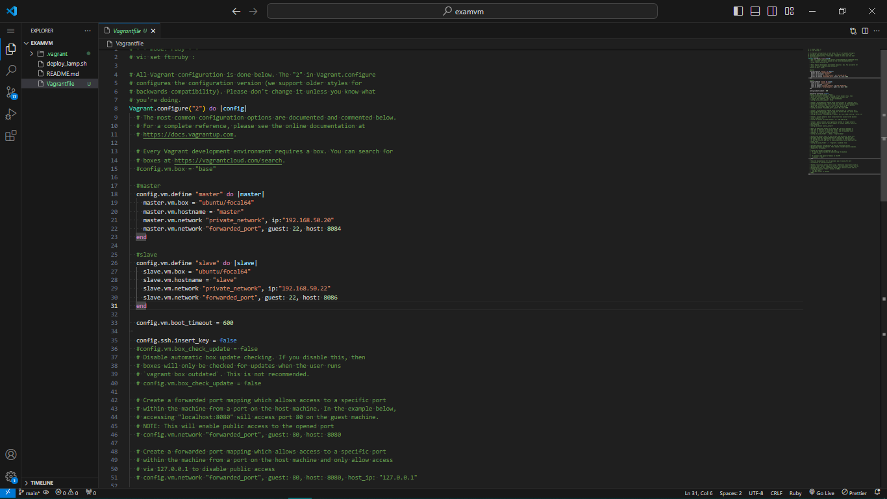
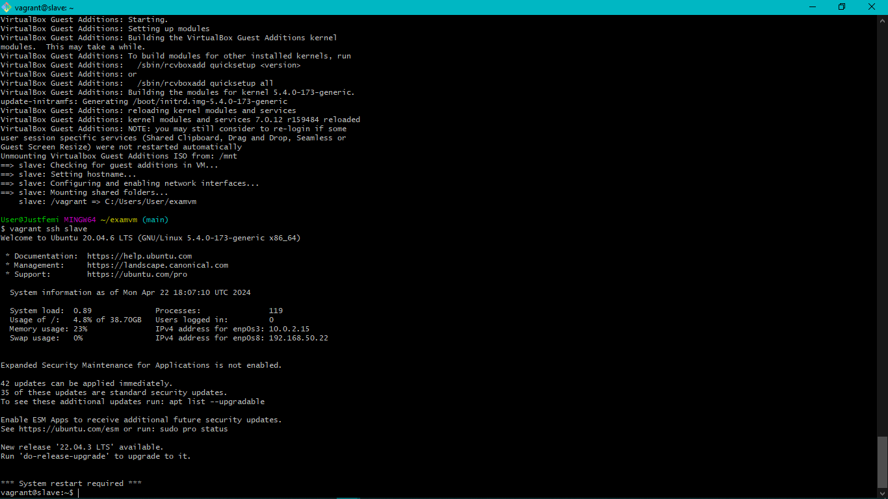
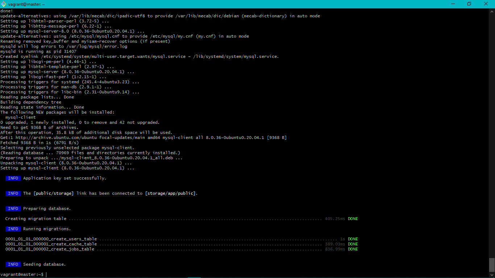
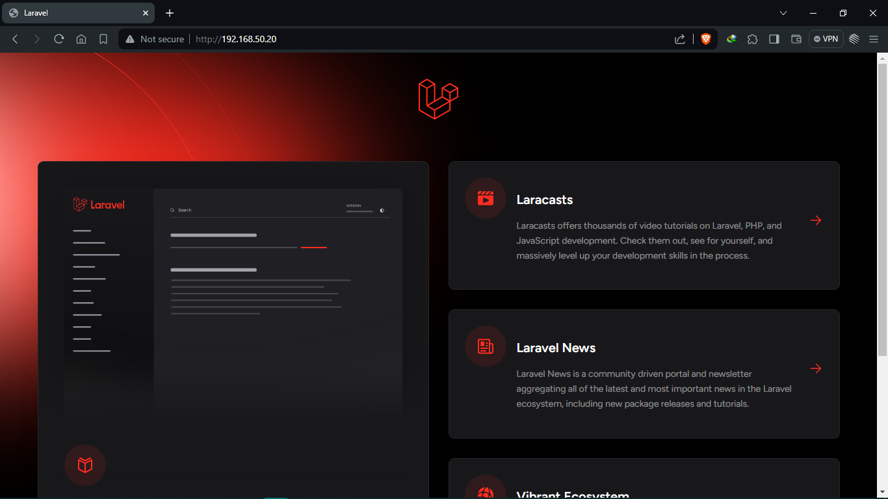
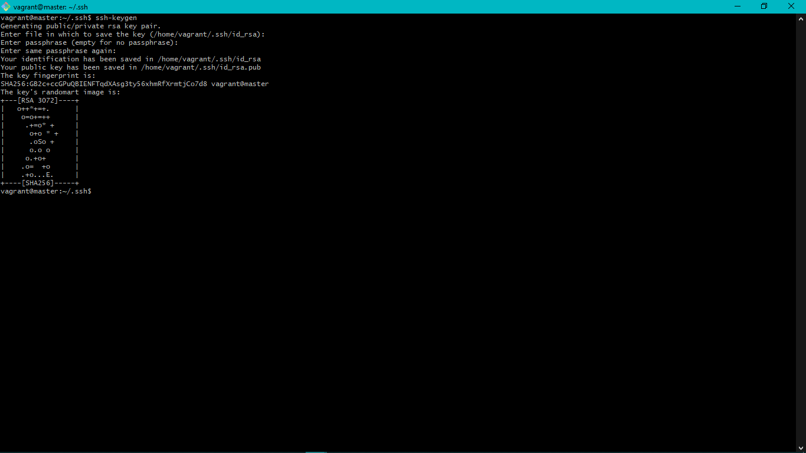
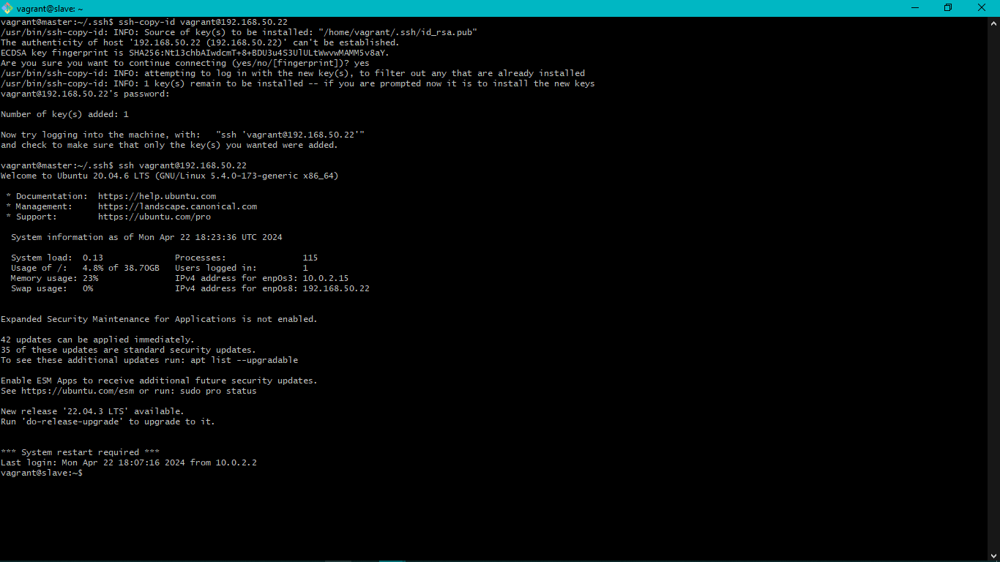
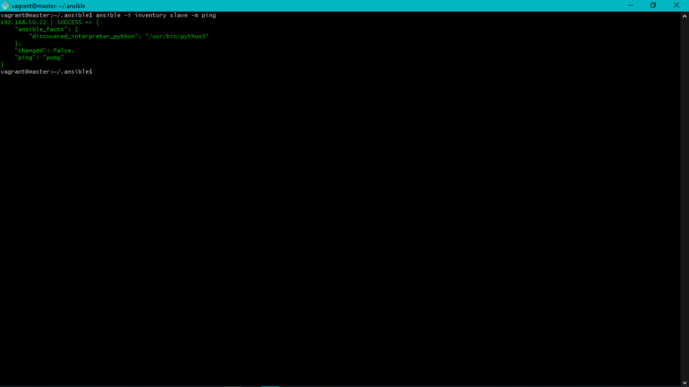

# Steps 

### 1. Provision two nodes in my Vagrantfile

### 2. ssh into my master node

### 3. ssh into slave node

### 4. Executed my script on the master node for testing and here are results both on my terminal and my browser with the master's IP Address - 192.168.50.20

### 5. Generated public and private key

### 6. Copied keypair from master to slave node and ssh into slave from master.

### 7. Pinged slave mode from master node

### 8. Output of playbook

### 9. Brower output of laravel deployment

### 10. Output of cron job

